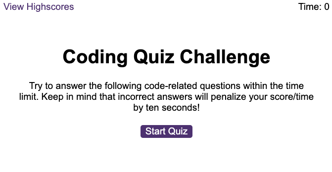

# Coding Quiz

## Description

This coding quiz is challenge 6 of the Front-End Web Developer bootcamp, which consists in a multiple choice quiz.

## Usage

- When pressing the Start Quiz button, the countdown starts and the first question is presented, with a set of answers.
- When an answer is selected, the programme checks whether it is correct or incorrect. 
- If it is correct, it displays 'Correct' and moves onto the next question.
- If it is incorrect, it displays 'Incorrect' and removes 15 seconds from the timer. It then moves onto the next question.
- Once the user has finished all the question or the countdown has reached 0, the quiz stops and the number of points is the number of seconds left.
- The user is then asked to provide their initials, which are then stored alongside their points, in the highscores.html file.

The programme looks like the below and the application can be found live [here](https://TBC)

